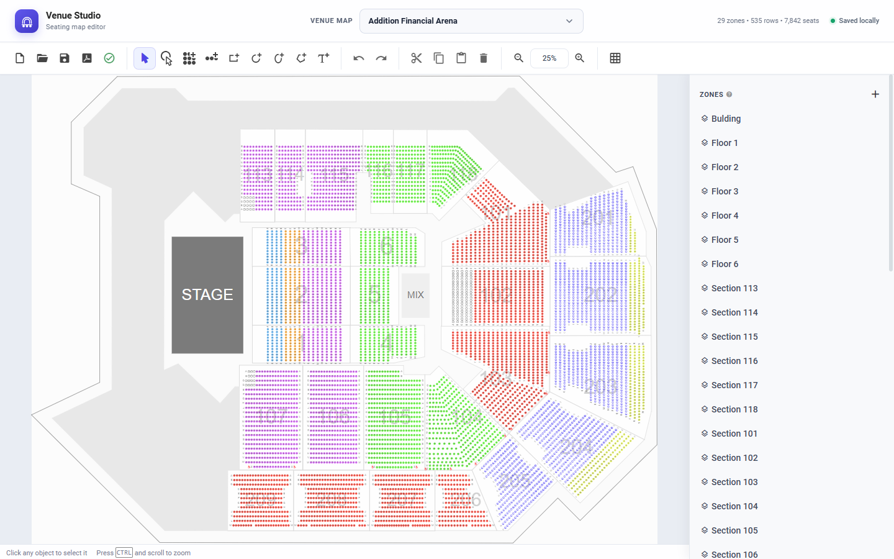

# Venue Studio

Venue Studio is a browser-based seating map editor for designing, reviewing, and exporting venue layouts. It includes a modernized workspace, built-in arena maps, live seating statistics, local persistence, and JSON/PDF export tools.



## Features

- Five built-in venue maps with instant in-app switching
- Automatic loading of Addition Financial Arena on the first visit
- Live zone, row, and seat totals
- Visual tools for rows, seats, shapes, labels, and zones
- Undo, redo, cut, copy, paste, zoom, and grid controls
- JSON import and export
- PDF export
- Automatic local saving in the browser
- Responsive loading feedback without page refreshes

## Built-in maps

- Addition Financial Arena
- Martha's Vineyard
- SunBet Arena
- VyStar Veterans Memorial Arena
- Yuengling Center Arena

## Run locally

This is a static application, but it must be served over HTTP so the browser can load the map JSON files.

```bash
python -m http.server 8000
```

Then open `http://localhost:8000`.

No package installation or build step is required.

## Using the editor

1. Choose a venue from the **Venue map** list.
2. Use the toolbar to select, add, move, or remove seating elements.
3. Edit zones and object properties in the right sidebar.
4. Use the save icon to download the current map as JSON.
5. Use the PDF icon to export a printable plan.

Changes are saved to browser local storage. Loading another built-in map replaces the active workspace, while the original map files remain unchanged.

## Project structure

```text
.
├── index.html          Application shell
├── css/                Editor and Venue Studio styles
├── js/                 Compiled editor and map-loading integration
├── maps/               Built-in seating-plan JSON files
├── img/                Editor artwork and tool icons
└── fonts/              Local font assets
```

## Deployment

Pushes to the `main` branch deploy automatically to GitHub Pages through the workflow in `.github/workflows/pages.yml`.

## Browser support

Use a current version of Chrome, Edge, Firefox, or Safari. Local storage must be enabled to preserve edits between sessions.

## Attribution and licensing

The compiled editor core is based on the [pretix seating plan editor](https://github.com/pretix/pretix) and includes third-party open-source packages. Copyright and licensing for those components remain with their respective owners. Review the [pretix license](https://github.com/pretix/pretix/blob/master/LICENSE) and bundled dependency notices before redistributing or using the application as a hosted service.

The Venue Studio interface, loading workflow, and included map integration are customizations made in this repository. No additional license is granted unless a separate `LICENSE` file is added by the repository owner.

